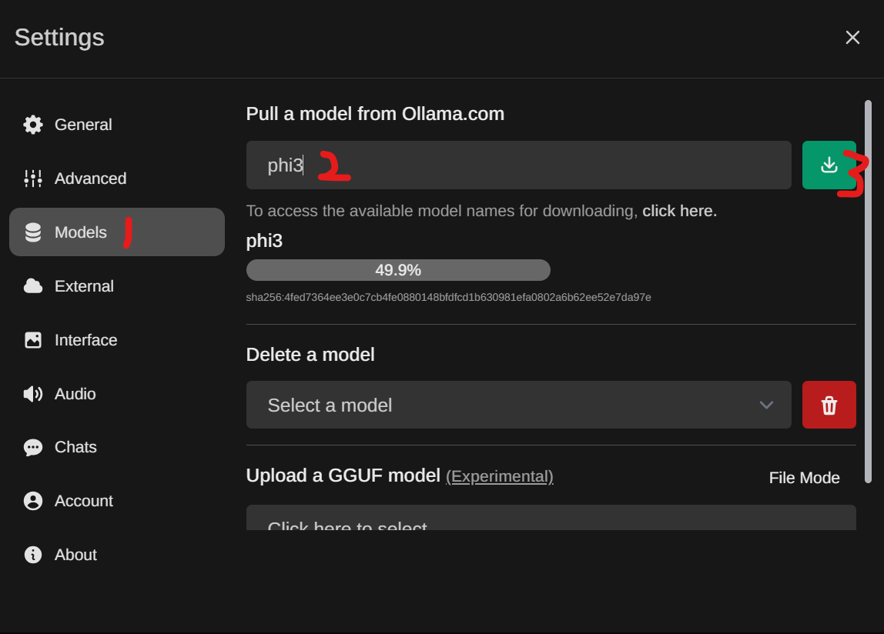
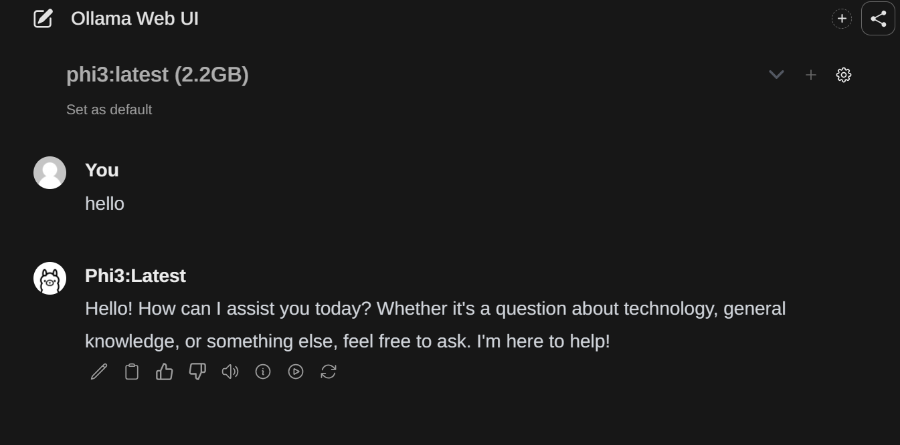

# Chat to Phi3 mini with Azure Container App

## **Prerequisites**

1. [install](https://learn.microsoft.com/en-us/cli/azure/install-azure-cli) the Azure CLI.
2.  For other sign-in options, see [Sign in with the Azure CLI](https://learn.microsoft.com/en-us/cli/azure/authenticate-azure-cli).


## Deploy App to Azure Container App:

1. sign in to the Azure CLI by using the [az login](https://learn.microsoft.com/en-us/cli/azure/reference-index#az-login) command. To finish the authentication process, follow the steps displayed in your terminal.

```bash
az login
```

2. Then you can follow the steps to create a new resource group and deploy the app to Azure Container App.

```bash
git clone https://github.com/xuhaoruins/phi3-aca.git

cd phi3-aca

az group create -l westus -n OllamaGroup

az containerapp compose create -g OllamaGroup --environment OllamaContainerappEnv --compose-file-path ".\docker-compose.yml"
```

3. Once the command execution complete. You **MUST** copy and store the following URLs:


4. Now revise ollama container to 4 CPU and 8Gi memory for supporting the Phi3 model inference.

```bash
az containerapp update --name ollama --resource-group OllamaGroup --cpu 4 --memory 8Gi
```

### Pull Phi3 model and Chat 

1. Open your browser and navigate to the following URL with **ollama-webui.xxx**. Then you can see the login page.


2. Click sigup and sign up with your email and password.


3. Then you can login to the app. ignore the first error message and click close.
 

4. Click setting to set your ollama endpoint.


5. Repalce the URL with your **ollama.xxx** URL into the input box, except for the **api** at the end. Click **update** button on the right and then click **save** button.


6. Click **Model** tab and download phi3 model


7. Now you can select the model at the first page.


8. You can chat with Phi3 mini and share to others!


